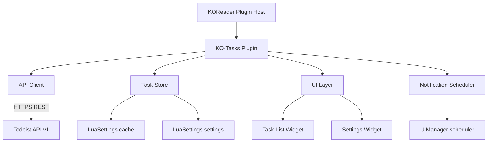

# System Overview — KO-Tasks for Todoist

## Purpose

A KOReader plugin that connects to the Todoist REST API v1, surfaces today's tasks (including overdue) directly on the device, supports upcoming date browsing, and optionally notifies the user when tasks are due — optimised for e-ink devices like the Kindle.

---

## Platform Constraints

| Constraint | Detail |
|---|---|
| Runtime | Lua 5.1 (KOReader's embedded interpreter) |
| Network | Available only when Wi-Fi is active; must use `NetworkMgr` |
| UI | E-ink display; no animations, minimal redraws preferred |
| Persistence | Plugin settings stored via `LuaSettings` / `G_reader_settings` |
| Background tasks | KOReader's `UIManager:scheduleIn()` — no true background threads |
| Device targets | Kindle (primary), Kobo, PocketBook (secondary) |

---

## High-Level Component Map



---

## Data Flow

```
1. User opens plugin
   → NetworkMgr ensures Wi-Fi
   → API Client fetches projects (once per session, cached)
   → API Client fetches today + overdue tasks in a single request
   → Tasks split client-side by due date and stored in Task Store

2. Task Store persists tasks and overdue_tasks to disk cache

3. UI renders task list:
   • Overdue section (if any overdue tasks and show_overdue = true)
   • Today section
   • Sort, direction, assignee filter, and group mode applied

4. Notification Scheduler walks today's task list and schedules
   UIManager callbacks for each time-specific due task

5. On callback fire → InfoMessage shown on screen

6. User actions (complete / reschedule / quick-add) use optimistic
   local update → API call → confirm or rollback (ADR-004)
```

---

## External Dependency

**Todoist REST API v1** — `https://api.todoist.com/api/v1/`

- Auth: `Authorization: Bearer <api_token>` header on every request
- All responses are JSON; list endpoints return `{results: [...], next_cursor}`

| Action | Endpoint |
|---|---|
| Today + overdue tasks | `GET /tasks/filter?query=today%20%7C%20overdue` |
| Arbitrary date filter | `GET /tasks/filter?query=<encoded>` |
| Projects list | `GET /projects` (cursor-paginated) |
| Close (complete) a task | `POST /tasks/{id}/close` |
| Update a task (reschedule) | `POST /tasks/{id}` |
| Create a task | `POST /tasks` |
| Current user profile | `GET /user` |

---

## Security

- API token stored in KOReader settings file (device-local, not synced)
- No token ever logged or displayed in plain text after initial entry
- HTTPS enforced; plugin must not fall back to HTTP
- Plugin is not created by, affiliated with, or supported by Doist (see SPEC-014)

---

## File Layout

```
todoist.koplugin/
├── main.lua                   # Plugin entry point & WidgetContainer subclass
├── api.lua                    # Todoist REST API v1 client
├── taskstore.lua              # In-memory + disk-cached task state
├── notifications.lua          # UIManager-based due-time scheduler
├── ui/
│   ├── tasklist.lua           # Today/overdue/upcoming task list widget
│   └── settings.lua           # Settings screen widget
└── _meta.lua                  # KOReader plugin metadata (name, version)
```
