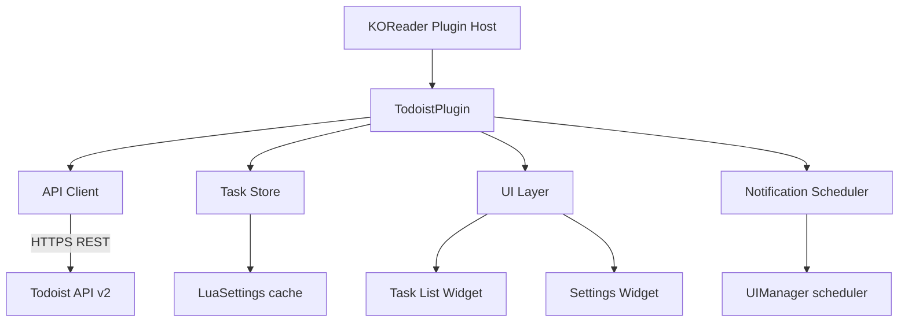

# System Overview — Todoist KOReader Plugin

## Purpose

A KOReader plugin that connects to the Todoist REST API, surfaces today's tasks directly on the device, and optionally notifies the user when tasks are due — optimised for e-ink devices like the Kindle.

---

## Platform Constraints

| Constraint | Detail |
|---|---|
| Runtime | Lua 5.1 (KOReader's embedded interpreter) |
| Network | Available only when Wi-Fi is active; must use `NetworkMgr` |
| UI | E-ink display; no animations, minimal redraws preferred |
| Persistence | Plugin settings stored via `LuaSettings` / `G_reader_settings` |
| Background tasks | KOReader's `UIManager:scheduleIn()` — no true background threads |
| Device targets | Kindle (primary), Kobo, PocketBook (secondary) |

---

## High-Level Component Map



---

## Data Flow

```
1. User opens plugin  →  NetworkMgr ensures Wi-Fi  →  API Client fetches today's tasks
2. Tasks stored in memory (+ optional disk cache)
3. UI renders task list
4. Notification Scheduler walks task list and schedules UIManager callbacks for each due time
5. On callback fire  →  InfoMessage shown on screen
```

---

## External Dependency

**Todoist REST API v2** — `https://api.todoist.com/rest/v2/`

- Auth: `Bearer <api_token>` header
- Tasks today: `GET /tasks?filter=today`
- No write operations in v1 of the plugin (read-only)

---

## Security

- API token stored in KOReader settings file (device-local, not synced)
- No token ever logged or displayed in plain text after initial entry
- HTTPS enforced; plugin must not fall back to HTTP

---

## File Layout (target)

```
todoist.koplugin/
├── main.lua                   # Plugin entry point & WidgetContainer subclass
├── api.lua                    # Todoist REST API client
├── taskstore.lua              # In-memory + cached task state
├── ui/
│   ├── tasklist.lua           # Today's task list widget
│   └── settings.lua           # Settings screen widget
├── notifications.lua          # Scheduler wrapper
└── _meta.lua                  # KOReader plugin metadata
```
