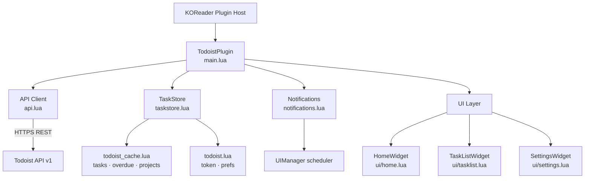

# System Overview — KO-Tasks for Todoist

## Purpose

KO-Tasks for Todoist is a KOReader plugin (internal name: `todoist`) that connects to the
Todoist REST API v1 and brings task management to e-ink reading devices. It surfaces today's
tasks (including overdue), an Inbox view, date-browsable Upcoming views, and optional due-time
notifications — all optimised for slow e-ink displays, intermittent Wi-Fi, and the constraints
of KOReader's embedded Lua 5.1 runtime.

---

## Platform Constraints

| Constraint | Detail |
|---|---|
| Runtime | Lua 5.1 (KOReader's embedded interpreter) |
| HTTP | `ssl.https` / `ltn12` primitives; no HTTP client library |
| Network | Wi-Fi may be off; must use `NetworkMgr`; HTTPS enforced |
| UI toolkit | KOReader `Menu`, `InfoMessage`, `ConfirmBox` widgets only; no animations |
| Display | E-ink; minimal redraws; full-screen `Menu` widgets preferred |
| Concurrency | No background threads; use `UIManager:scheduleIn()` for deferred work |
| Persistence | `LuaSettings` / `G_reader_settings`; `flush()` rewrites the whole file |
| Device targets | Kindle (primary), Kobo, PocketBook (secondary) |

---

## High-Level Component Map



---

## Data Flow

### 1 — Open plugin (tap "Todoist" in Tools menu)

1. `TodoistPlugin:openTaskList()` checks for a stored API token; redirects to Settings if absent.
2. `HomeWidget` is created and pushed onto the UIManager stack — it remains there for the
   entire session as the base layer.
3. The user selects a view from the Home menu.

### 2 — Open Today view

1. `TaskListWidget:new { view_mode = "today" }` is created and pushed on top of HomeWidget.
2. `TaskListWidget:refresh()` checks the disk cache (ADR-003):
   - **Cache fresh + offline** → render cached tasks with an "offline / stale" banner.
   - **Cache fresh + online** → render cached tasks immediately; silently refresh in background.
   - **Cache stale or empty** → block on a live API fetch before rendering.
3. `api:getTodayAndOverdueTasks()` sends `GET /tasks/filter?query=today%20%7C%20overdue`.
4. The response is split client-side: tasks with a due date before today go to `overdue_tasks`;
   the rest go to `tasks`. Both arrays are written to `TaskStore` and flushed to disk.
5. `TaskStore:getProjects()` returns the cached project map or fetches `GET /projects`
   (cursor-paginated) if not yet loaded this session.
6. The widget builds the `Menu` item list, applying sort mode, direction, assignee filter,
   and overdue-section grouping, then calls `UIManager:show(self._menu)`.
7. `Notifications:schedule()` walks the today task list and registers `UIManager:scheduleIn()`
   callbacks for any time-specific due tasks.

### 3 — Open Inbox view

1. `TaskListWidget:new { view_mode = "inbox" }` is pushed onto the stack.
2. `refresh()` always does a live fetch: `GET /tasks/filter?query=%23Inbox`.
3. Results are kept in the widget's `_view_raw_tasks` field only — **not** written to
   `TaskStore` and **not** persisted to disk (session-transient).
4. Menu is rendered with the same sort/filter pipeline as Today.

### 4 — Open Upcoming view

1. Home navigates directly to `TaskListWidget { view_mode = "upcoming" }` pushed on top of
   HomeWidget. Default range is **next 7 days** anchored to today.
2. `_buildUpcomingQuery()` constructs the filter string:
   - `upcoming_start_ts == nil` → `next%20N%20days` (natural-language, server-resolved)
   - `upcoming_start_ts` set → ISO date-range: `due%20after%3A%20<start-1>%20%26%20due%20before%3A%20<start+N>`
3. `GET /tasks/filter?query=<encoded>` is called; results are kept in `_view_raw_tasks` only.
4. Tasks are **grouped by due date** into `is_title = true` section headers
   (e.g. `"Mon 14 Jul · Today"`); days with no tasks are omitted.
5. A tappable date-range item at the top of the list opens KOReader's native
   `DateTimeWidget` so the user can jump to any start date.
6. A `"Range: N days"` footer button cycles 7 → 14 → 30 → 7 and re-fetches.
7. Upcoming results are session-transient (never cached).

### 5 — Complete a task

1. User taps a task → `ConfirmBox`; on confirm, the task is immediately removed from the
   local list (optimistic update — ADR-004).
2. `api:closeTask(id)` fires `POST /tasks/{id}/close` in the background.
3. **Success** → `TaskStore` is updated and flushed; pending state cleared.
4. **Failure** → task is restored at its original list position; `⚠` badge added;
   error message shown with a "Retry" option.

### 6 — Notification fires

1. `UIManager:scheduleIn()` callback triggers at the task's due time.
2. `Notifications` checks whether the task is still in the local store (not yet completed).
3. If still present, `UIManager:show(InfoMessage)` displays the task title on-screen.
4. After device resume (`onResume`), the sweep is re-armed to catch any callbacks that
   the monotonic clock may have missed during suspend.

---

## Navigation Architecture

Navigation follows a **UIManager stack** model introduced in SPEC-011 (see ADR-005).

```
UIManager stack (bottom → top)
─────────────────────────────────────────────────────
  HomeWidget._menu          ← always present after plugin open
  TaskListWidget._menu      ← pushed when user picks Inbox / Today / Upcoming
  (sub-menu: range picker)  ← pushed by HomeWidget for Upcoming presets
─────────────────────────────────────────────────────
```

- **Home is never closed** during a session; it is the persistent base layer.
- Child views call `UIManager:close(self._menu)` in their Back button handler; KOReader
  automatically reveals the widget below — no explicit back-callback is needed.
- All three views (Today, Inbox, Upcoming) share a single `TaskListWidget` class,
  parameterised by `view_mode = "today" | "inbox" | "upcoming"`.

---

## External Dependencies

**Todoist REST API v1** — `https://api.todoist.com/api/v1/`

Auth: `Authorization: Bearer <api_token>` header on every request.
All list responses return `{ results: [...], next_cursor }`.

| Action | Endpoint |
|---|---|
| Today + overdue tasks | `GET /tasks/filter?query=today%20%7C%20overdue` |
| Inbox tasks | `GET /tasks/filter?query=%23Inbox` |
| Upcoming / arbitrary filter | `GET /tasks/filter?query=<encoded>` |
| Projects list | `GET /projects` (cursor-paginated, cached per session) |
| Complete a task | `POST /tasks/{id}/close` → HTTP 204 |
| Reschedule a task | `POST /tasks/{id}` with `due_string` |
| Create a task | `POST /tasks` with `content` and optional `due_string` |
| Current user profile | `GET /user` (resolves caller ID for assignee filter) |

---

## Security

- API token entered once in Settings; stored device-locally in `todoist.lua` (KOReader
  settings directory, not synced or transmitted).
- Token is **never** logged or displayed in plain text after initial entry.
- HTTPS is required; the plugin does not fall back to HTTP.
- Task titles are stored on disk in `todoist_cache.lua`; the file sits inside KOReader's
  existing settings directory with no additional encryption — users should not share it.
- The plugin is not created by, affiliated with, or supported by Doist (see SPEC-014).

---

## File Layout

```
todoist.koplugin/
├── main.lua               # Plugin entry point; registers Tools menu item; opens HomeWidget on tap
├── api.lua                # Todoist REST API v1 client (all HTTP calls)
├── taskstore.lua          # In-memory + disk-cached task state (today, overdue, projects)
├── notifications.lua      # UIManager-based due-time scheduler; re-arms on device resume
├── _meta.lua              # KOReader plugin metadata (name, version)
└── ui/
    ├── home.lua           # Home navigation screen (Inbox / Today / Upcoming / Settings)
    ├── tasklist.lua       # Coordinator: widget lifecycle, shared constants, extend() calls (~150 lines)
    ├── sort_filter.lua    # _filterTasks, _sortTasks, sort comparators (SPEC-007, SPEC-015)
    ├── task_row.lua       # _buildTaskItem — shared row builder used by all views
    ├── render_today.lua   # _fetchAndRender, _render, _renderError — Today + overdue view
    ├── render_views.lua   # _fetchAndRenderView, _renderView, _renderViewError — Inbox + Upcoming
    ├── actions.lua        # _onTaskTap, _completeTask, _showRescheduleMenu, _rescheduleTask
    └── settings.lua       # Settings screen (token, sort, filter, notifications)
```

---

## Composition Pattern (ADR-006)

All `ui/task*.lua` and `ui/render_*.lua` submodules follow the `extend(T, C)` pattern:
- Each file exports a single `M.extend(T, C)` function.
- The coordinator (`tasklist.lua`) calls every `extend` at module-load time, installing
  methods directly onto the shared `TaskListWidget` table.
- Constants (`SORT_MODES`, `PRIO_PREFIX`, etc.) are defined once in `tasklist.lua` and
  passed as `C` to each submodule — no globals, no circular `require`.
- No file in `ui/` may exceed 300 lines (ADR-006 guard against re-bloat).
